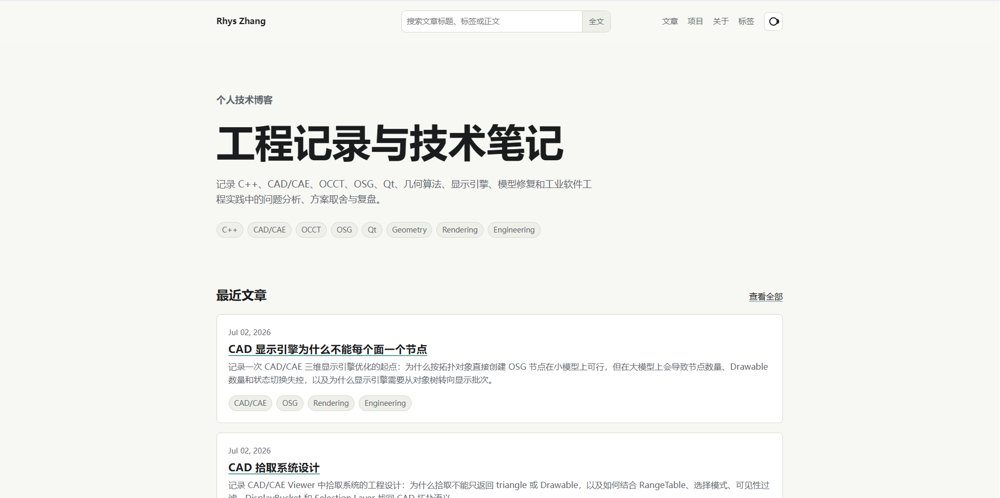

# Rhys Zhang

C++ / CAD / CAE / OCCT / Geometry / Rendering / Engineering Tools

I work on CAD/CAE geometry processing, model import/export, topology analysis, geometry repair workflows, and large-scale 3D viewer architecture. My current interests are focused on OCCT-based shape inspection, CAD model repair, rendering data organization, and practical engineering patterns for industrial software.

  <a href="https://rhyszhang.com">Blog</a> ·
  <a href="https://github.com/Prokaroty">GitHub</a> ·
  <a href="mailto:rhys.zhang.tech@gmail.com">Email</a>

---

## About Me

I am a C++ developer working in the CAD/CAE and industrial software field.

My work is mainly related to geometry modeling, CAD data exchange, geometry repair, large model visualization, and engineering architecture around C++ desktop applications. I care more about stable engineering design than short-term feature stacking, and I prefer building tools and systems that can be maintained, tested, and explained clearly.

Current role:

* Software Engineer working on CAD/CAE industrial software
* Focus: CAD/CAE geometry processing, OCCT-based modeling and repair, large-scale 3D visualization
* Location: Chengdu, China

Technical areas I am currently working on:

* CAD/CAE model import and export
* OCCT shape traversal, topology analysis, and repair workflows
* Large model rendering architecture
* Picking, selection, highlighting, and display indexing
* C++ engineering, CMake, Qt, OSG, and cross-platform build workflows

---

## Current Focus

I am currently building small public engineering projects around CAD/CAE geometry and OCCT. These projects are not intended to be large commercial systems. They are public engineering labs used to summarize, verify, and document practical problems I have encountered in real CAD/CAE development.

Planned public projects:

* **occ-shape-inspector**
  A C++/OCCT tool for inspecting CAD shape topology, geometry statistics, and repair risks.

* **cad-repair-lab**
  An experimental C++/OCCT lab for model diagnosis, repair decisions, and repair result comparison.

* **occ-topology-playground**
  Small OCCT experiments for understanding topology traversal, shape hierarchy, and geometry relationships.

* **cpp-cmake-project-template**
  A clean C++ project template with CMake, tests, formatting, and GitHub Actions.

---

## Engineering Experience

The following experience is summarized and sanitized. It does not include internal project names, customer data, private models, confidential logs, or unpublished business details.

### CAD/CAE Geometry Processing

I have worked on CAD/CAE geometry processing features based on C++ and OCCT, including model import/export, topology traversal, shape classification, geometry repair, and engineering workflows around model validation.

Typical work includes:

* STEP, IGES, BREP, STL, OBJ, VRML, glTF, and other model data workflows
* Shape hierarchy traversal and topology statistics
* Solid, shell, face, wire, edge, and vertex level processing
* Geometry repair workflow design
* Import-time validation and repair strategy design
* Repair result comparison and diagnostic reporting

### Geometry Repair Workflow

I have worked on geometry repair workflows where model repair is treated as a staged engineering process instead of a single “fix all” operation.

The general structure I prefer is:

1. Analyze model problems
2. Classify repair risks
3. Decide repair strategy
4. Execute targeted repair operations
5. Compare topology and geometry before and after repair
6. Report results in a form that can be reviewed and debugged

This experience also influences my public project direction, especially `occ-shape-inspector` and `cad-repair-lab`.

### Large Model Visualization

I have worked on CAD/CAE viewer architecture and large model display optimization, especially around scene organization, rendering data batching, picking, highlighting, visibility control, and partial rebuild strategies.

Typical topics include:

* Display data extraction from CAD topology
* Object / face / edge level display indexing
* Range table design for restoring CAD topology from rendering primitives
* Selection, highlighting, and visibility state management
* Large model bucket organization
* Partial update and dirty bucket rebuild strategies
* Viewer migration and legacy rendering path cleanup

### Engineering Architecture

I care about keeping engineering systems understandable and maintainable.

Some principles I usually follow:

* Keep public APIs stable once exposed
* Separate data construction, rendering state, and interaction state
* Avoid mixing temporary display effects with base model data
* Keep migration layers explicit and removable
* Prefer small verifiable tools over large unclear abstractions
* Write design documents when the code alone is not enough

---

## Technical Stack

Languages and tools I use frequently:

* C++
* TypeScript
* Markdown / MDX
* CMake
* Git / GitHub
* Qt
* OCCT
* OSG
* SQLite
* Astro
* Cloudflare Pages

Areas I am interested in:

* CAD/CAE
* Computational Geometry
* Geometry Repair
* Rendering Architecture
* Model Import / Export
* Engineering Toolchains
* C++ Architecture
* Industrial Software

---

## Blog

I write technical notes and engineering reflections on my personal blog:

**https://rhyszhang.com**

The blog mainly records long-term learning and engineering experience around:

* C++
* CAD/CAE
* OCCT
* OSG
* Qt
* Geometry algorithms
* Display engine design
* Model repair
* Engineering architecture
* Toolchains
* Project retrospectives

> 中文博客：主要记录 C++、CAD/CAE、OCCT、几何修复、显示引擎和工程架构相关内容。
I prefer writing about real engineering problems: how the problem appeared, how I analyzed it, what detours I took, and what engineering judgment was finally formed.

---

## Public Project Direction

My public repositories are intended to be small, focused, and reproducible.

I prefer projects that have:

* Clear engineering boundaries
* Runnable examples
* Tests or benchmark data
* Design notes
* Practical constraints
* Honest limitations

I do not aim to build a full CAD system in a single public repository. Instead, I prefer extracting specific engineering problems into small public labs.

Current roadmap:

* Build an OCCT-based shape inspection tool
* Build a geometry repair workflow lab
* Document common CAD topology problems
* Add reproducible examples and reports
* Connect project notes with blog articles

---

## Contact

* Blog: https://rhyszhang.com
* GitHub: https://github.com/Prokaroty
* Email: rhys.zhang.tech@gmail.com

For technical discussion, I am mostly interested in C++, CAD/CAE, OCCT, geometry repair, model import/export, and large model visualization.
